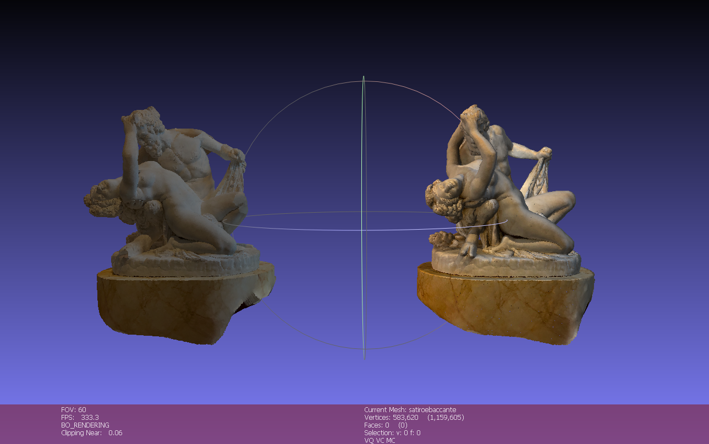
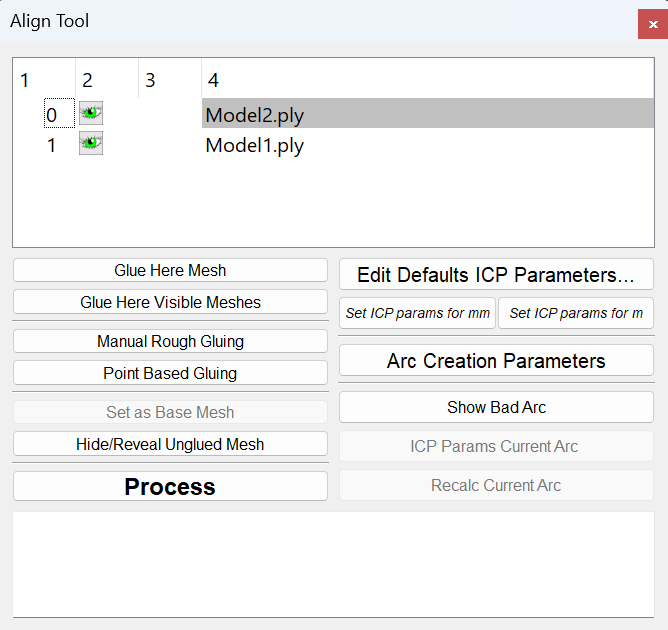
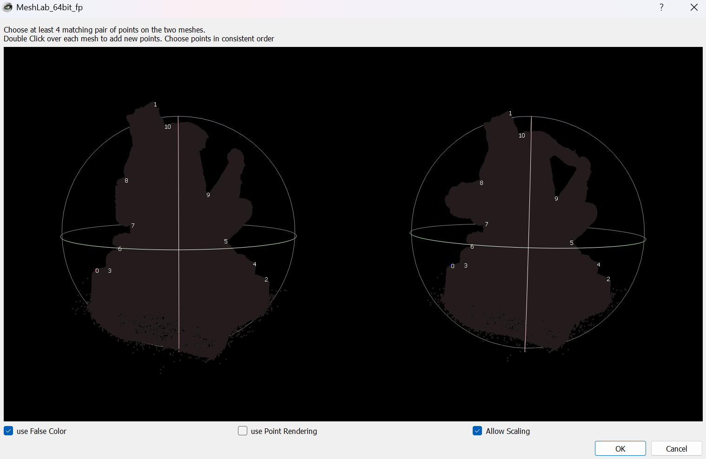
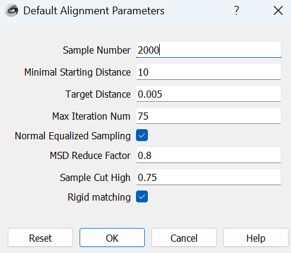
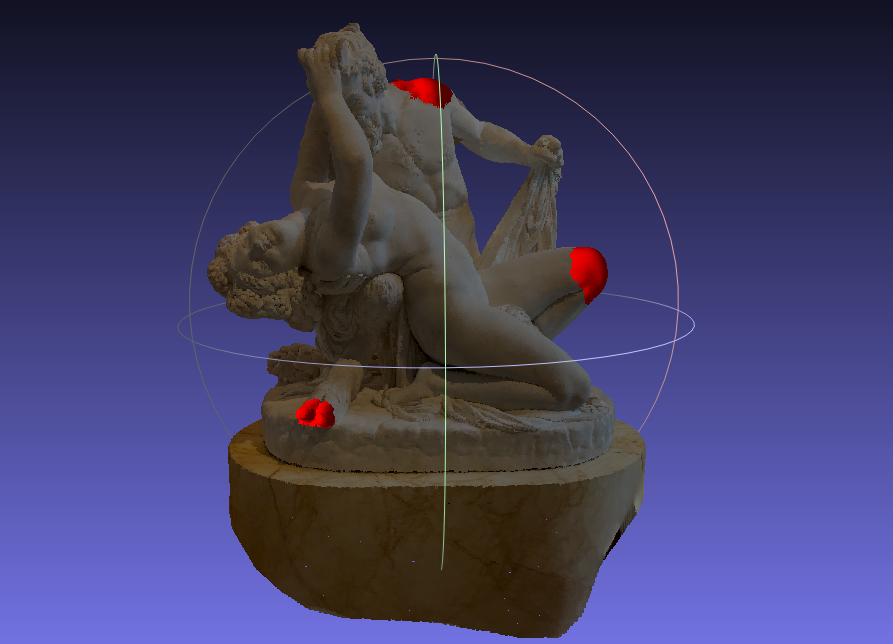
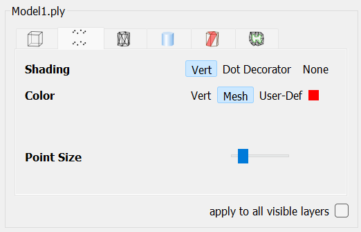
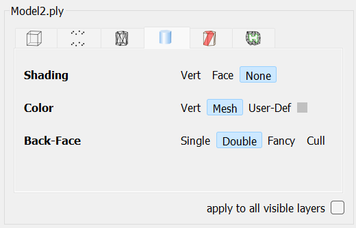
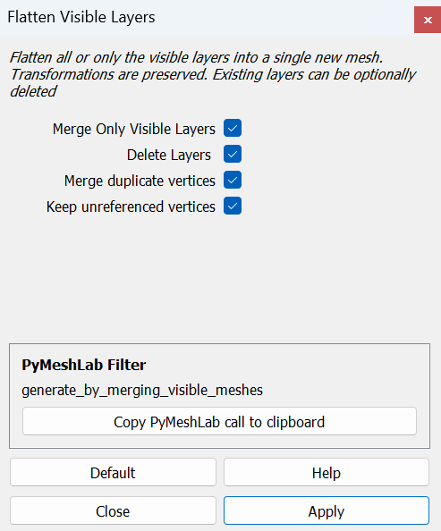

# ICP Merging Meshlab

## Overview

This project focuses on the comparison and alignment of two 3D models in SPLAT PLY format using [MeshLab](https://www.meshlab.net/). The first model represents the complete statue, while the second simulates a damaged version with missing parts, mimicking real-world scenarios where artifacts undergo natural degradation over time. These simulations were implemented by exploiting [Blender](https://docs.blender.org/)’s point cloud editing capabilities. The goal of the project is to explore different alignment techniques available in MeshLab, specifically Point Pairs Picking and Iterative Closest Point (ICP), to accurately align the two models. Once aligned, the models are merged into a single output, providing a basis for further analysis and visualization of changes between the two versions. Additionally, the project aims to deepen the understanding of 3D transformations, alignments, and the practical challenges associated with combining complex 3D datasets. 

## Requirements

- **MeshLab** version 2023.12 or later.
- Two 3D models in **SPLAT PLY** format. Example models can be found in this repository in the **models** folder.

## Usage

### Import the model

1) Open **MeshLab**
2) Go to **File** > **Import Mesh** and load **Model2** (broken statue). The order is important.
3) Repeat the same step to load **Model1** (complete statue).

You should now see both models in the Layer Dialog and in the main window.

### Navigation in MeshLab 

- Left mouse button + drag: rotate around trackball center
- Mouse wheel: move forward or backward
- Center mouse button + drag: pan
- Shift + mouse wheel: change camera field of view
- Double click on specific point: places that point at the trackball center
- Control + mouse wheel: moves near clipping plan
- Control + Shift + mouse wheel: moves far clipping plan
- Alt + Enter: enter full screen mode
- Control + Shift + left mouse button + drag: changes light direction (this only takes effect if there are normals)

### Perform Alignment 

To start the alignment process, click on the respective icon (symbolized with letter A in the tool bar). It will launch the **Align Dialog** as it is shown.

1) In the pop-up window you need to choose which point cloud is to be set as reference. Select **Model1** (complete statue) and click on **Glue Here Mesh**. With this, an asterisk appears next to the point cloud name.
   
2) Select **Model2** and click on **Point Based Glueing**. In the pop-up window, in one side you have the reference point cloud and on the other side you have the moving point cloud.
   This stage is called Points Pair Picking: the idea is to roughly align both point clouds by manually defining homologous points (4 points are recommended).

   Points can be all selected in one point cloud and then all selected in the other point cloud (by the same order), or we can select one point at each time on both point clouds.
   Controls:
   - Double click: select a point
   - CTRL + double click: remove a point

     
     
4) Click **OK** after picking the points. Another asterisk can be found next to the aligned point cloud.
5) Click on **Edit Defaults ICP Parameters** before running the ICP. Default parameters are set in absolute units.
   - The sample number means the number of homologous points that the software will try to find and use for the optimization.
   - The minimal starting distance means the radius that will be used to find the homologous points in one point cloud starting with a set of points in the other point cloud.
   - The target distance is an average alignment error value that the software will try to obtain from the process. With terrestrial laser scanning point clouds, this value should be small (0.005m at least).
   - The Rigid matching option should be selected if we are aligning point clouds that have the same scale. If we don’t select this option, a scale factor will be introduced in the final transformation matrix.
   - The Max Iteration Num is the maximum number of iterations that the software will perform.

     

6) Click **Process** to launch the ICP algorithm. Results are shown in the log window.
  
    

## Visual Customization

This section covers how to customize the appearance of the 3D models: changing the color can be useful to highlight specific features, such as erosion or missing parts, while adjusting the light direction helps improve visibility and perception of surface details during visualization.

Color Adjustment:
1) Select **Model1** in the Layer Dialog.
2) Select **Points** in the Tool Bar (or in the Layer Dialog).
3) Select **Vert** for shading.
4) Select **User-Def** for color. Select the little color square to choose a color. We impose red color to evidence the missing parts.

   

Light Adjustment:
1) Select the **model** that you want to change light in the Layer Dialog.
2) Select **Vert** in Tool Bar (or in the Layer Dialog).
3) Select **Double** for Black-Face.
4) Use **Control + Shift + left mouse button + drag** to change light direction.

   

## Merge the Aligned Models

1) Once the alignment is complete, go to **Filters** > **Mesh Layer** > **Flatten Visible Layers**.
2) Ensure that both models are visible and selected in the Layer Dialog.
3) Click **Apply** to merge the two aligned models into a single output model.

   

## Export the merged model

1) Go to File > Export Mesh As.
2) Choose the desired output format (PLY) and click Save.
3) Make sure to enable the options for saving vertex colors and normals if applicable.

# More Considerations

During the experiments we observed that there were some limitation of the software, mainly on the alignment methods.
The main limitation is that the ICP algorithm in MeshLab can only be executed after performing a Point Pairs Picking process. 
This method is prone to high error rates, since inevitably there isn’t an absolute precision picking points manually.
Hence, it significantly reduces the accuracy and reliability of the ICP alignment.

If you need more precise MeshLab instructions, please follow this guide: [Meshlab_Tutorial_iitd](https://www.heritagedoc.pt/doc/Meshlab_Tutorial_iitd.pdf)

# Collaborators

This project was developed by:

- [@Martin-Martuccio](https://github.com/Martin-Martuccio) - Martin Martuccio
  
- [@PSamK](https://github.com/PSamK) - Samuele Pellegrini
  
- [@biaperass](https://github.com/biaperass) - Bianca Perasso
  
- [@LorenzoMesi](https://github.com/LorenzoMesi) - Lorenzo Mesi
  
## Contact

For questions, issues, or collaborations, please contact:

- Martin Martuccio: [martinmartuccio@gmail.com](Martin:martinmartuccio@gmail.com)

- Samuele Pellegrini: [pellegrini.samuele.1@gmail.com](Samuele:pellegrini.samuele.1@gmail.com)

- Bianca Perasso: [bianca.perasso@gmail.com](Bianca:bianca.perasso@gmail.com)

- Lorenzo Mesi: [mesilorenzo@gmail.com](Lorenzo:mesilorenzo@gmail.com)

# Acknoledgements
 
This project was developed to explore the potential of Gaussian Splatting techniques for cultural heritage preservation, as part of the project exam for the course [Augmented and Virtual Reality](https://corsi.unige.it/off.f/2023/ins/66562) during Master's degree in Computer Engineering - Artifical Intelligence at the University of Genova.

# License

This project is licensed under the MIT License. See the `LICENSE` file for details.

